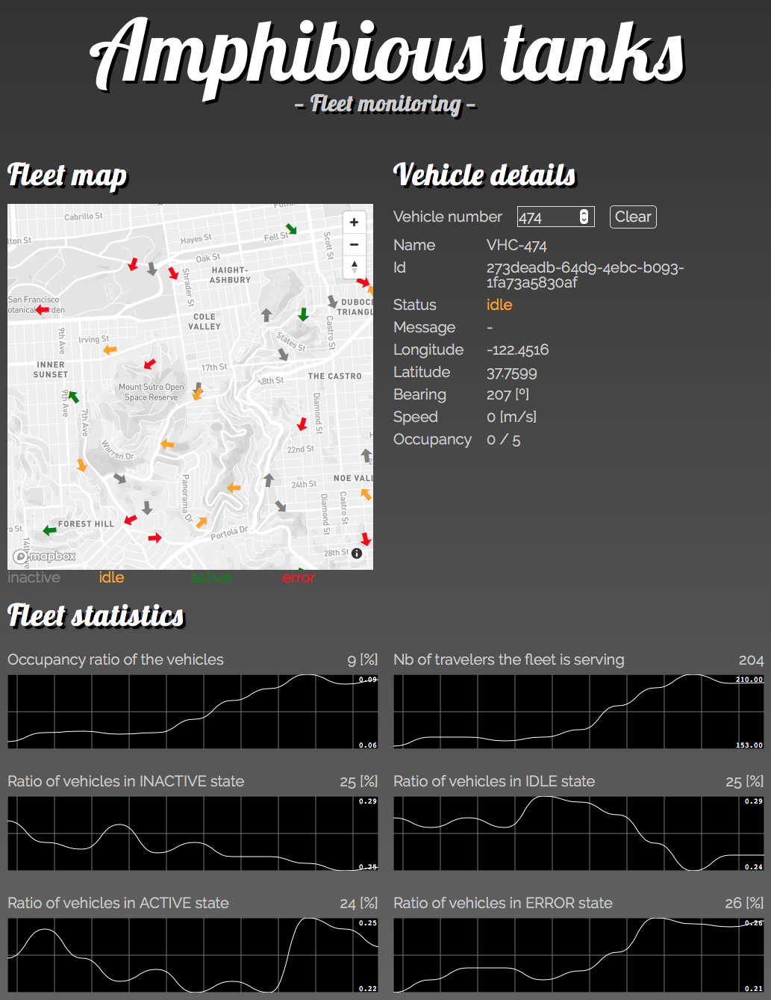
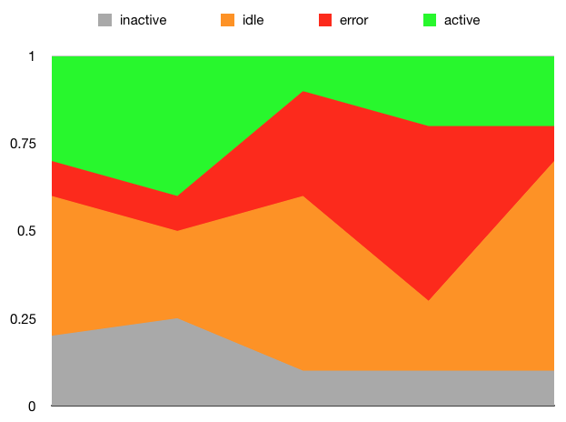

# BestMile home assignment

This is a small project for the monitoring of a fleet of vehicles. The [assignment](doc/assignment.md) mentions that

> Our vehicles are amphibious tanks.

so this repository is called `amphibious-tanks`.

After downloading the code, you should

1. build the client app with `cd client/`, `npm install` and `npm run build` (or alternatively, use the dev code with `npm start`)
1. start the server with `cd server/`, `npm install` and `node app.js`
1. go to [http://localhost:3000/](http://localhost:3000/)

## Implementation notes

- [x] _Expose the data through a Node.JS web server so it can be consumed by a web client_

As it was not explicitly requested to provide an API endpoint for the web client, I thought it would be fun to try using sockets and update the vehicles map in realtime, using [socket.io](https://socket.io). I'm not so sure about the performance implication of this choice. If I were to go the API route after all, I would create a `/vehicles` endpoint answering to `GET` requests. The client would then poll the server every x seconds. One could even make the refresh rate a UI input that the user can adjust himself: `<input type="range" min="1" max="60" step="1">`

- [x] _Create a very simple React application_

I have close to no experience with [ReactJS](https://reactjs.org) so I opted for [create-react-app](https://github.com/facebookincubator/create-react-app). I'm usually not a big fan of boilerplate packages, because you always end up with code you don't need and forget to remove. Given my lack of experience it seemed fitting though. 

[At some point](https://github.com/manofewords/amphibious-tanks/commit/6b8e75723d98a05bad04ded76d8dadbc9cf260d0), the state management of the application became a bit annoying. I think it would have been nicer to use something like [Redux](https://redux.js.org). Like for ReactJS, I have never used Redux, so I focused on finishing the home assignment in an acceptable time instead. I might still look into Redux after handing the assignment in, maybe on another branch.

- [x] _Consume the data and display it on a map_
- [x] _Make sure you display only relevant data to the operator_

I chose to use Mapbox, just not to use the ubiquitous Google Maps. The [react-map-gl](https://uber.github.io/react-map-gl/#/) package, made by Uber, makes the integration into a React app a bit easier. 

The vehicles are displayed as [⬆ arrows](client/src/components/VehicleMarker.js) to easily visualise the bearing. This is a unicode character that is actually displayed as an emoji on iOS (for example, see screenshot). To avoid this, I could use an SVG arrow, or an actual car icon. 

I haven't invested any time into trying to make the map responsive. This might be my biggest disappointment, because mobile/tablet friendliness is something I value very highly!

The speed of the car could be represented with the size: bigger cars are faster cars. I'm not sure this is useful however. Another thing that would be nice is to show a "trail" of the last 30 or so positions:

- [x] _Some vehicles can have problems and will raise them through an 'ERROR' status. This information is very important for the remote operator_

I'm using [colors to represent the states of the vehicles](client/src/vehicleStatus.css). The error message is shown on the vehicle details, when you search for or click on a vehicle.

- [x] _Provide statistics you feel are important to the operator or his company_

I only provide the statistics suggested [in the handout](doc/assignment.md#instructions-). However, I thought it would be fun to show how the values change over time. I'm using [Smoothie Charts](http://smoothiecharts.org) to plot a time series for every statistic. This could be improved by having fixed Y axis and displaying target values. The error rates graphs could be stacked areas, since their total always amounts to 100%: 

- [x] _Provide a search function on the UI for the operator to select a single vehicle for advanced monitoring_
  
For the search input I chose the vehicle number. Typing a valid number will zoom in on the corresponding vehicle on the map, and show the vehicle's details. A "Clear" button will reset the search and zoom the map back out. It is also possible to view a vehicle's details by clicking on it on the map.
  
- [x] _Make sure your web application is robust. Provide tests with your assignment_

In order to stay in a reasonable time frame, I chose to only write component logic tests, no rendering tests. These include [calculating the statistics](client/src/components/FleetStatistics.test.js), [correctly determining a vehicle's bearing](client/src/components/VehicleMarker.test.js), and others. The tests can be run in watch mode via `npm test`.

- [x] _Please provide the full git history with the assignment_

I haven't spent much time structuring the CSS code nicely. I'm not even using [Sass](http://sass-lang.com) or [PostCSS](http://postcss.org). I still wanted to try something new and went with [CSS grid layouts](https://developer.mozilla.org/en-US/docs/Web/CSS/CSS_Grid_Layout), which [are now supported](https://caniuse.com/#feat=css-grid) on the latest versions of all browsers. I've started building some responsiveness – 2 columns grid on large screens, 1 column grid on small screens – but it's clearly not done.

## Epilogue

I enjoyed working on this little project because I could get back into [ReactJS](https://reactjs.org), try out [sockets](https://socket.io) and use a [CSS grid layout](https://developer.mozilla.org/en-US/docs/Web/CSS/CSS_Grid_Layout) for the first time. I also always have fun playing with maps. Thanks.
